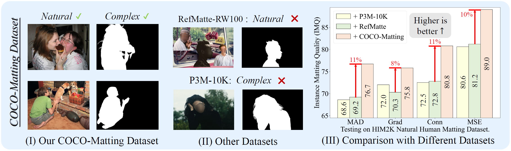
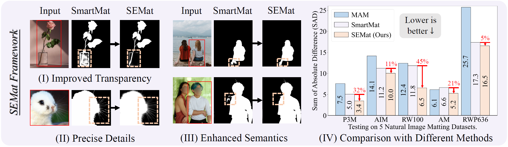
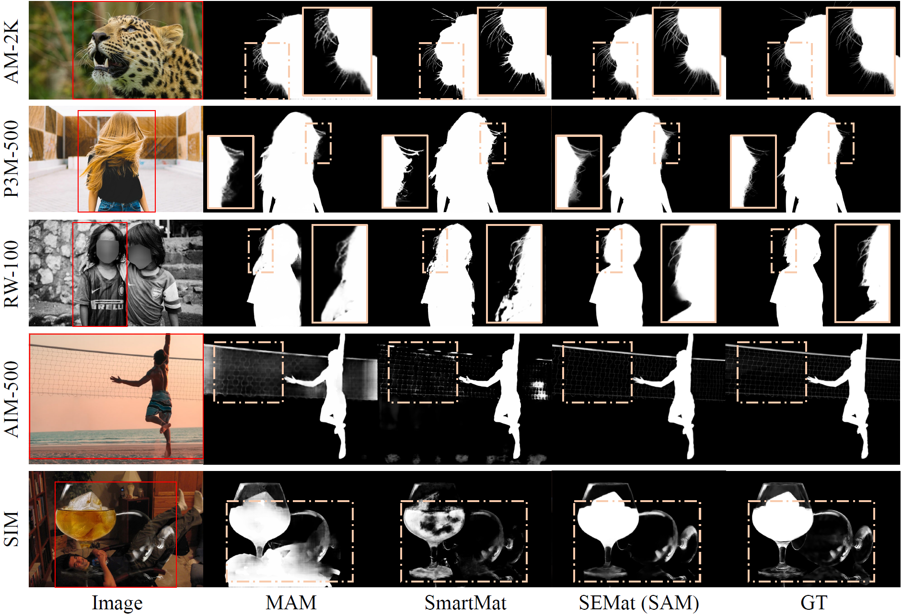

# Towards Natural Image Matting in the Wild via Real-Scenario Prior

In this paper, we propose the COCO-Matting dataset and SEMat framework to revamp training datasets, network architecture, and training objectives. Solving the problem of inappropriate synthetic training data, unaligned features and mattes from a frozen SAM, and end-to-end matting loss lacking generalization, we greatly improve the interactive matting performance on diverse datasets.

**:sun_with_face: COCO-Matting**
<p align="center">
  
<br>
Our COCO-Matting features both natural and complex scenes. Training SEMat with COCO-Matting enables a substantial lead on HIM2K than using RefMatte and P3M-10K.
</p>

**:sparkles: SEMat**
<p align="center">
  
<br>
Our SEMat trained on COCO-Matting significantly outperforms the SoTA methods like MAM and SmartMat on several datasets, especially in transparency, details, and semantics.
</p>

## :star: Visual Results
<p align="center">
  
<br>
</p>

## :hammer_and_wrench: Environment Setup
* Create a conda virtual env and activate it.

  ```
  conda create -n SEMat python==3.8.8
  conda activate SEMat
  ```
* Install packages.

  ```
  cd path/to/SEMat
  pip install -r requirements.txt
  ```
* Install [detectron2](https://github.com/facebookresearch/detectron2) , follow its [documentation](https://detectron2.readthedocs.io/en/latest/). For instance:
  ```
  python -m pip install 'git+https://github.com/facebookresearch/detectron2.git'
  ```

## :nut_and_bolt: Preparing the testing datasets

1. Download the testing dataset: [AIM-500](https://github.com/JizhiziLi/AIM), [RefMatte-RW100](https://github.com/JizhiziLi/RIM), [AM-2K](https://github.com/JizhiziLi/GFM), [P3M-500](https://github.com/JizhiziLi/P3M), [RWP-636](https://github.com/yucornetto/MGMatting), and [SIM](https://github.com/nowsyn/SIM)

2. Modify the dataset path in line 4-12 of `./configs/semantic_enhanced_matting/dataloader.py`

3. The data folder structure should look like this:
```
path/to/datasets
├── AIM-500
│   ├── mask
│   ├── original
│   ├── ...
├── RefMatte_RW_100
│   ├── image
│   ├── mask
│   ├── ...
├── AM-2K
│   ├── validation
│   │   ├── mask
│   │   ├── original
│   │   ├── ...
├── P3M-10k
│   ├── validation
│   │   ├── P3M-500-NP
│   │   │   ├── mask
│   │   │   ├── original_image
│   │   │   ├── ...
├── RealWorldPortrait-636
│   ├── alpha
│   ├── image
│   ├── ...
├── SIMD
│   ├── generated_testset
│   │   ├── defocus
│   │   │   ├── alpha
│   │   │   ├── merged
│   │   ├── ...
```
Please note that:
* The `generated_testset` in SIMD should be generated following [SIM](https://github.com/nowsyn/SIM)


## :arrow_forward: Inference with SEMat

Download the trained model of [SEMat (SAM)](https://drive.google.com/file/d/1favKFLPEsH6cjbwMryo17AMhIKrLQyFK/view?usp=sharing) or [SEMat (HQ-SAM)](https://drive.google.com/file/d/1993J0GcGysY_d7O6cK-00tHKsmY-RBRa/view?usp=sharing) or [SEMat (SAM2)](https://drive.google.com/file/d/1JqsNFIV3Q06eLhhzuMjRcv98bL3Lph9i/view?usp=sharing) and put them in the `checkpoints` folder. Then, you can inference with different SEMat versions:

Choose one testing dataset by replace `[dataset]` with  `RW100 / AIM500 / AM2K / P3M500 / RWP636 / SIM` in the following commands.

1. SEMat (SAM)
```
python main.py --config-file configs/SEMat_SAM.py --eval_dataset [dataset] --init_from ./checkpoints/SEMat_SAM.pth --num-gpus 1 --eval-only 
```

2. SEMat (HQ-SAM)
```
python main.py --config-file configs/SEMat_HQ-SAM.py --eval_dataset [dataset] --init_from ./checkpoints/SEMat_HQ-SAM.pth --num-gpus 1 --eval-only
```

3. SEMat (SAM2)
```
python main.py --config-file configs/SEMat_SAM2.py --eval_dataset [dataset] --init_from ./checkpoints/SEMat_SAM2.pth --num-gpus 1 --eval-only
```

## :label: TODO 

- [ ] Release our COCO-Matting dataset.
- [ ] Testing on the HIM2K dataset.
- [ ] Release training codes.

## :hearts: Acknowledgements

Thanks [Detectron2](https://github.com/facebookresearch/detectron2), [ViTMatte](https://github.com/hustvl/ViTMatte), [DiffMatte](https://github.com/YihanHu-2022/DiffMatte), [GroundingDINO](https://github.com/IDEA-Research/GroundingDINO), [SAM](https://github.com/facebookresearch/segment-anything), [HQ-SAM](https://github.com/SysCV/sam-hq) and [SAM2](https://github.com/facebookresearch/sam2) for their public code and released models.


## :black_nib: Citation